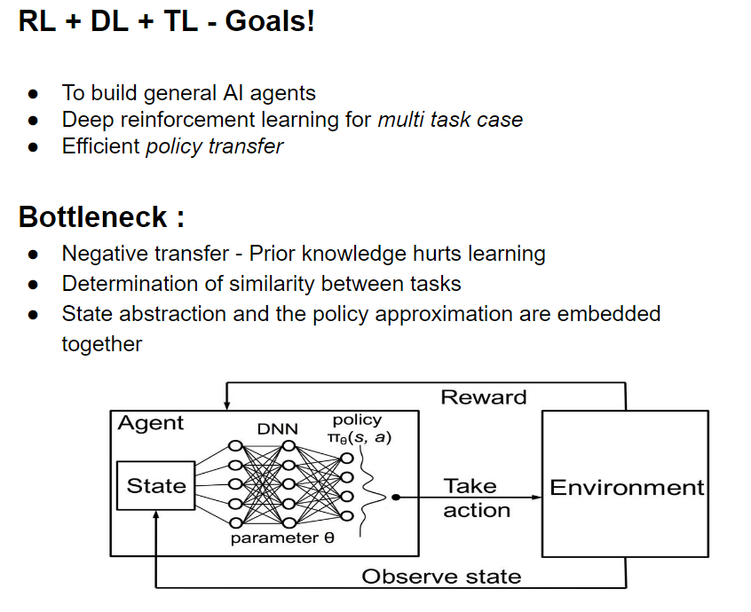
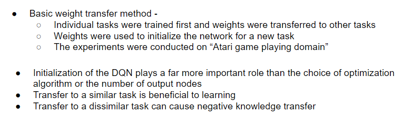
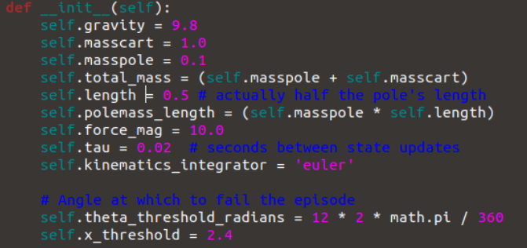
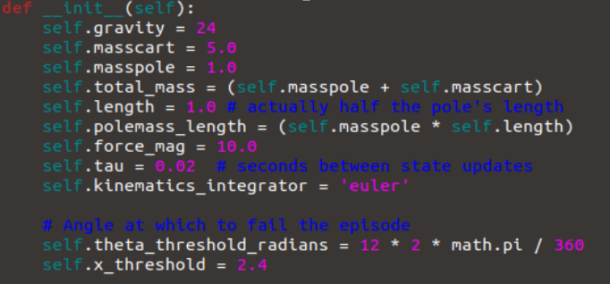
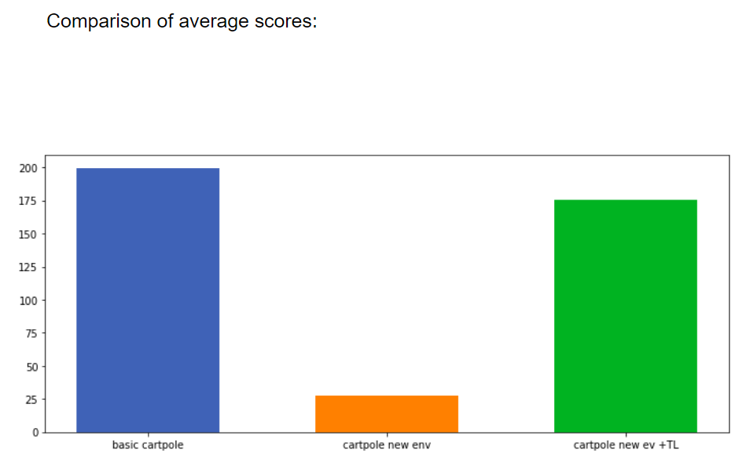
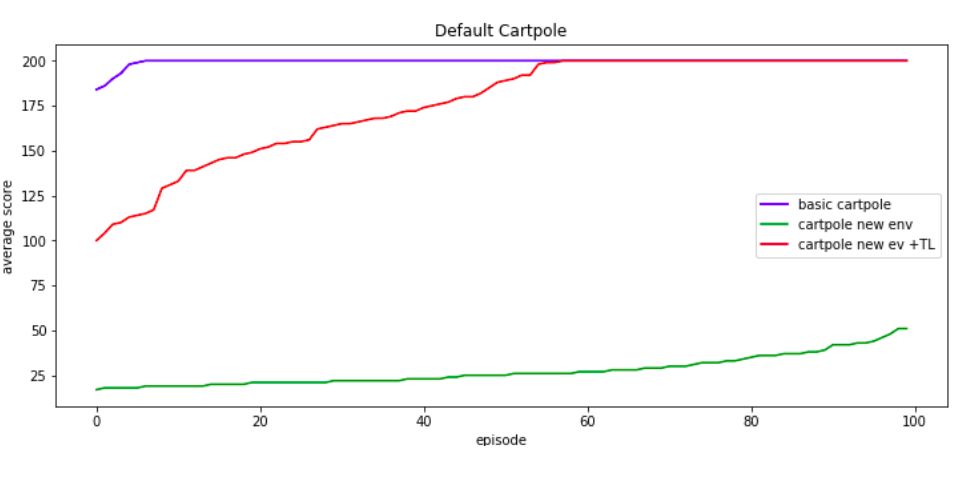

# Transfer-learning-in-Deep-Reinforcement-learning
In this project, I use transfer learning on cartpole (openAI) env to demonstrate the transferring of weights in Reinforcement learning and its advantages and limitations.

# Outline of this project: 
1. We train a basic cartpole using the data generated by playing "some random games"
2. Later transfer the knowledge(weights) learnt from this to another similar task or environment.
3. New task(env) is created by changing the source file of cart pole(details below)

# Results :

